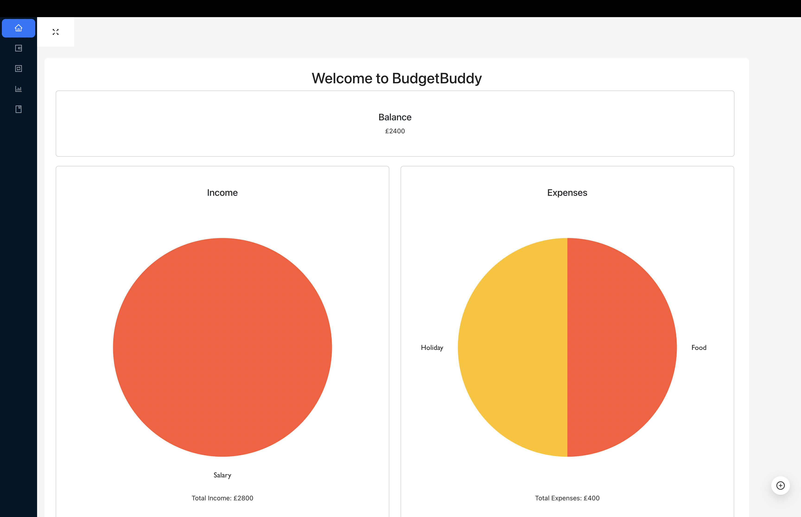
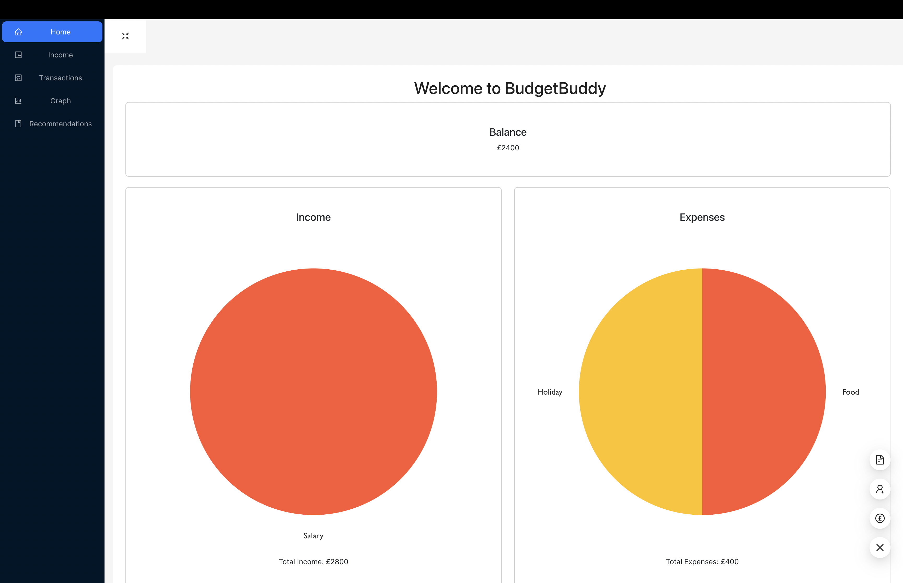

# BudgetBuddy 

[](https://opensource.org/licenses/MIT)

Welcome to BudgetBuddy, your go-to solution to financial stability. 

## Description

BudgetBuddy is a comprehensive expense tracker designed to revolutionise personal finance management. Users can effortlessly log their income and expenses, categorise transactions, and set budgetary limits tailored to their financial objectives. 

With intuitive graphs and charts, BudgetBuddy offers insightful visualisations of spending patterns, empowering users to make informed decisions about their finances.

The app also enables users to set savings goals, track progress, and generate customisable reports for deeper analysis. With our commitment to security and multi-platform accessibility, BudgetBuddy is the go-to solution for individuals seeking to optimise their spending habits, save efficiently, and achieve long-term financial stability.


## Features
- **Live Transactions:** View detailed information about transactions as you add them 👀
- **Dynamic and Fast:** The Project is not only dynamic but fast at rendering, thanks to Vite + React ⚡
- **Sleek and Modern:** Thanks to a combination of packages, the project looks sleek and modern without sacrificing performance 👓

## Installation
To install this project, follow the simple steps below:

1. Clone the repository to your local machine
```
git clone git@github.com:reececorkhill/BudgetBuddy.git
```
2. Navigate to the project directory
```
cd BudgetBuddy
```
3. Install dependencies
```
npm install
```

## Usage

View the live site <a href="https://lucent-bonbon-7b187a.netlify.app/"> here</a>.

1. Run the application
```
npm run dev
```
2. Navigate to localhost:5173 in your browser.
3. Enjoy and don't hesitate to contact us!

## Screenshots





## License

This project is licensed under the MIT license.